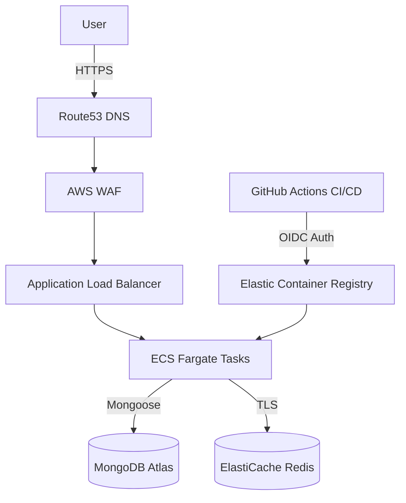

# ParkOps Cloud Architecture

## High-Level Topology

## Security & Secrets
- **MongoDB Atlas**: Network peered via VPC Peering. Port 27017 is strictly open only to the ECS Task Security Group.
- **Secrets Manager**: JWT Secrets, Atlas Connection Strings, and Payment Provider APIs are injected directly into ECS Fargate containers via AWS SecretsManager at runtime. They are NEVER stored in `.env` or Docker images.
- **OIDC Deployment**: GitHub Actions leverages OpenID Connect to assume an AWS IAM role temporarily. There are no static AWS Access Keys stored in GitHub Secrets.

## Observability
- ECS tasks automatically stream `stdout` to AWS CloudWatch Logs.
- Alarms are configured for `HTTP 5xx > 1%` and `ECS CPU Utilization > 80%`.
