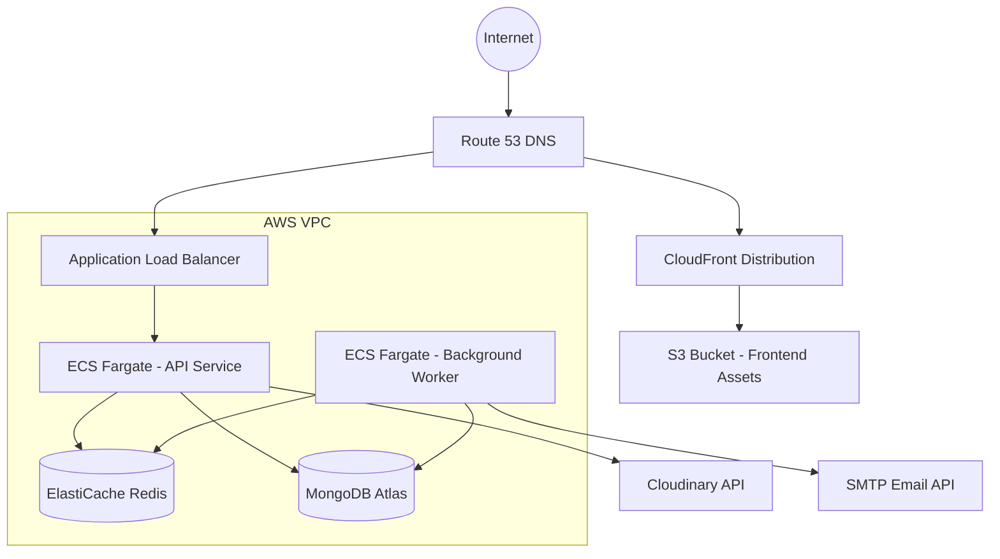

# ParkOps Cloud Architecture

This document describes the cloud architecture deployed for the ParkOps Smart Parking System.

## Architecture Diagram

## Key Components

- **Route 53**: DNS management for custom domain names.
- **CloudFront & S3**: Hosts the static React frontend. CloudFront provides global CDN caching and SSL/TLS.
- **Application Load Balancer (ALB)**: Routes HTTPS traffic to the ECS API instances and handles SSL termination.
- **ECS (Fargate)**: Serverless compute engine running containerized applications.
  - **API Service**: Handles incoming HTTP requests and Socket.IO real-time connections.
  - **Worker Service**: Runs background cron jobs independently without exposing HTTP ports.
- **ElastiCache for Redis**: Provides distributed locks, caching, and Socket.IO multi-node event brokering (via `@socket.io/redis-adapter` and `@socket.io/redis-emitter`).
- **MongoDB Atlas**: Managed database cluster outside the AWS VPC, connected via secure URI.
- **Secrets Manager**: Stores sensitive credentials like `MONGO_URI`, `JWT_SECRET`, and `REDIS_URL`.
