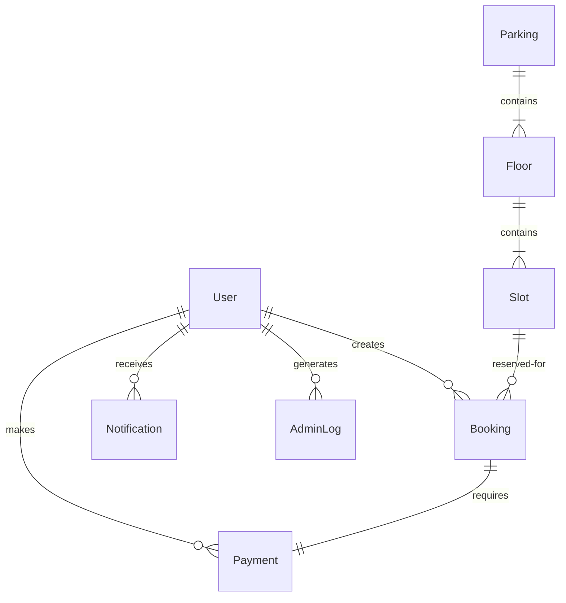

# Database Architecture

ParkOps utilizes MongoDB (Atlas) for its flexible schema design, enabling rapid iteration on parking complex structures while maintaining document consistency.

## Entity Relationship Diagram (ERD)

## Core Collections

### `users`
Stores authentication credentials, profile data, and roles (`customer`, `operator`, `admin`).
- **Indexes:** `email` (unique)

### `parkings`
Top-level entity for a physical parking location.
- **Fields:** Name, Location (GeoJSON), Total Capacity.
- **Indexes:** `location` (2dsphere)

### `floors` & `slots`
Represents the physical layout.
- **Slot Fields:** Number, Type (compact, EV, large), Status, Base Price.
- **Indexes:** `parkingId`, `floorId`

### `bookings`
The central transactional record tying a User to a Slot for a specific time range.
- **Fields:** `startTime`, `endTime`, `status` (pending, confirmed, checked-in, completed, cancelled), `vehicleNumber`.
- **Indexes:** `slotId`, `startTime`, `endTime` (Critical for preventing double-bookings).

### `payments`
Tracks the financial transaction associated with a booking.
- **Fields:** `bookingId`, `providerTransactionId`, `amount`, `status`.

### `adminLogs`
Immutable audit trail of actions taken by operators and admins (e.g., slot deletion, manual check-in).
