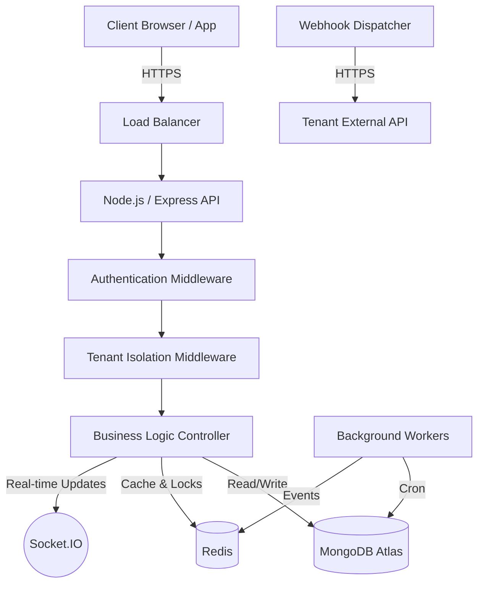
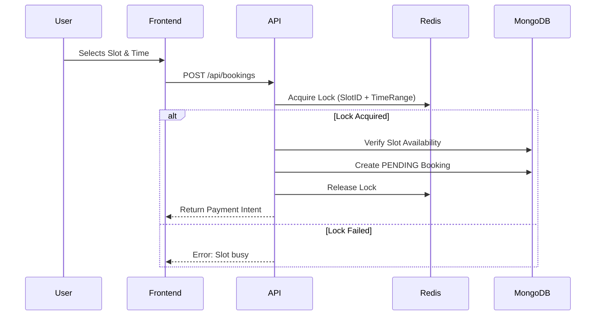

# System Architecture

```mermaid
graph TD
    Client[Client Browser / App] --> |HTTPS| LB[Load Balancer]
    LB --> API[Node.js / Express API]
    API --> Auth[Authentication Middleware]
    Auth --> Tenant[Tenant Isolation Middleware]
    Tenant --> Controller[Business Logic Controller]
    
    Controller --> |Read/Write| MongoDB[(MongoDB Atlas)]
    Controller --> |Cache & Locks| Redis[(Redis)]
    Controller --> |Real-time Updates| SocketIO((Socket.IO))
    
    Background[Background Workers] --> |Cron| MongoDB
    Background --> |Events| Redis
    
    Webhook[Webhook Dispatcher] --> |HTTPS| ExternalTenantAPI[Tenant External API]
```

# Booking Flow

```mermaid
sequenceDiagram
    participant User
    participant Frontend
    participant API
    participant Redis
    participant MongoDB
    
    User->>Frontend: Selects Slot & Time
    Frontend->>API: POST /api/bookings
    API->>Redis: Acquire Lock (SlotID + TimeRange)
    alt Lock Acquired
        API->>MongoDB: Verify Slot Availability
        API->>MongoDB: Create PENDING Booking
        API->>Redis: Release Lock
        API-->>Frontend: Return Payment Intent
    else Lock Failed
        API-->>Frontend: Error: Slot busy
    end
```
